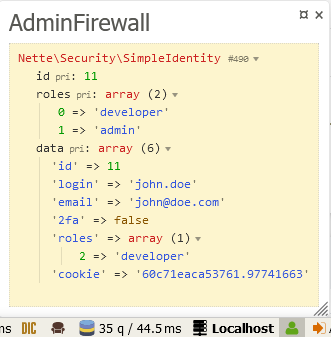

Installation
----

The best way to install Contributte/Firewall is using [Composer](http://getcomposer.org/):

```sh
composer require contributte/firewall
```

Configuration
----

```php
<?php
declare(strict_types=1);

namespace App\Security;

class AdminFirewall extends \Contributte\Firewall\Authentication\BaseFirewall
{
	public function authenticate(string $login, string $password): void
	{
		// check credentials
		$this->login(new \Nette\Security\SimpleIdentity('User ID'));
	}
}
```

```neon
extensions:
	firewall: Contributte\Firewall\DI\FirewallExtension

firewall:
	namespaces:
		admin: App\Security\AdminFirewall
		web: App\Security\WebFirewall
```

Firewalls are using `Contributte\Firewall\Bridges\SessionStorage` by default.
This storage is just a bridge for `\Nette\Bridges\SecurityHttp\SessionStorage`.

You can create your own storage by implementing `Contributte\Firewall\Authentication\UserStorage`.
Then you can use it as default storage for all firewalls or just for one.

```neon
firewall:
	storage: App\Security\CustomSecurityStorage # custom storage
	namespaces:
		admin:
			firewall: App\Security\AdminFirewall
			storage: App\Security\CustomAdminStorage # custom storage for AdminFirewall
		web:
			firewall: App\Security\WebFirewall
			validator: App\Security\IdentityValidator
			authorizator: App\Security\Authorizator
```

Firewalls can use Identity Validators to update data in Identity.

You can achieve the same functionality if storage implements `\Nette\Security\IdentityHandler`.
Firewall will then use `sleepIdentity` and `wakeupIdentiy` functions instead of IdentityValidator.

Tracy Panel
----
The library includes its own Tracy panel to show information about currently used Firewall and stored identity.



To disable the default Tracy panel for Nette/Security, add this lines to your `config.neon`.
```neon
security:
	debugger: false
```
